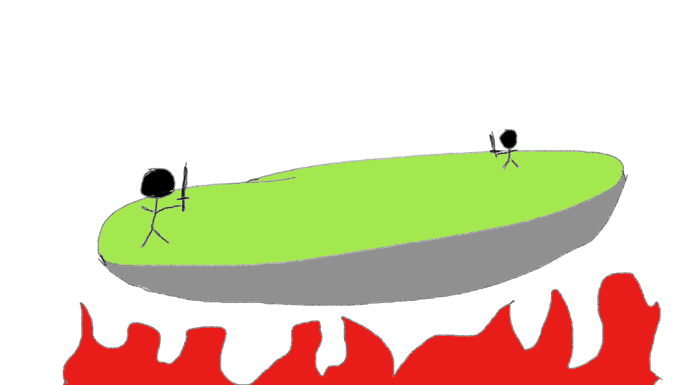

# Iai

## By Frank Timmons

## Description
Iai will be a melee focused online multiplayer versus game.  It will allow players to connect in a room and battle it out to see who is the best.  The combat will be focused around hitting eachother off of the arena similar to something like Super Smash Brothers, but in first person.  There will be a fluid movement system and a way to chain your moves together in combos.  The multiplayer will be setup using Photon, a multiplayer solution for Unity, and will allow up to 20 concurrent users with the free plan I will be using.

## Minimum Features
* Melee Combat
* A map to fight on
* A way to win or lose
* Online Lobby system
* Multiplayer connection

## Tools
* Unity 
* C# 
* Paid Tutorial on Udemy that will supply me with premade assets (3D models, UI designs, sound effects)
* Photon (unity networking solution that is detailed in the tutorial)
* Itch.io (webiste for hosting games)

## Bonus Features
* Custom 3D character and weapon models
* Custom UI

## Ideal Combat System
The tutorial I am following goes over how to create a first person shooter multiplayer game, but I'm hoping to refactor it into a melee focused arena fighter a la Smash Bros or the Wii Sports resort Fencing game. Crude diagram: 

## Aditional tools required
* Blender

## Other Info
I'm going to be following a course I purchased during a sale on Udemy to complete my MVP, then modify the code to fit my vision once I am done.  [Here is a link to the course](https://www.udemy.com/course/unity-online-multiplayer/).